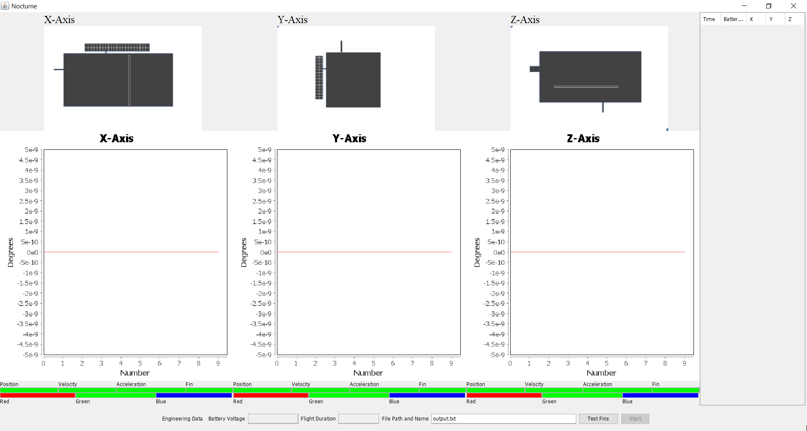
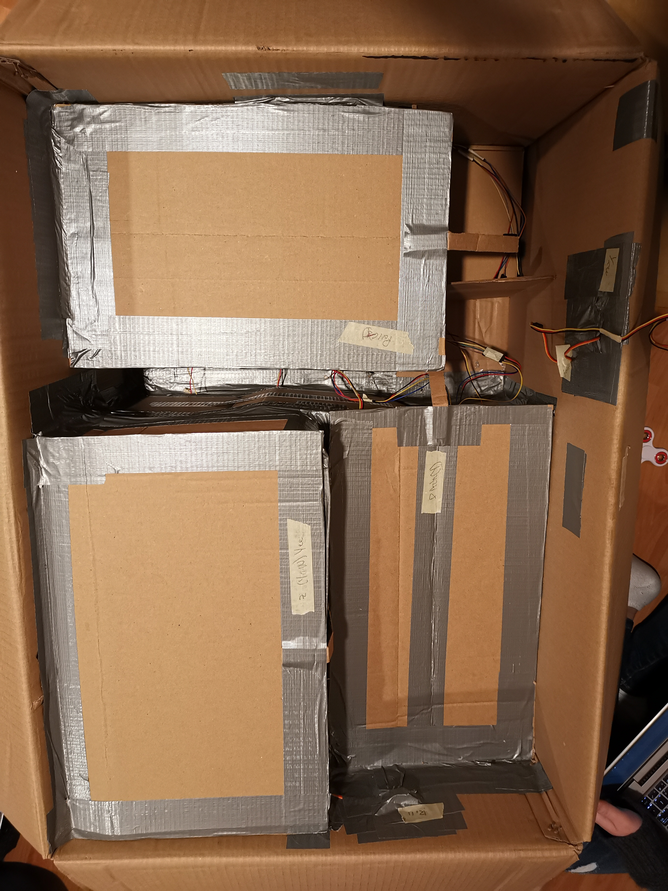
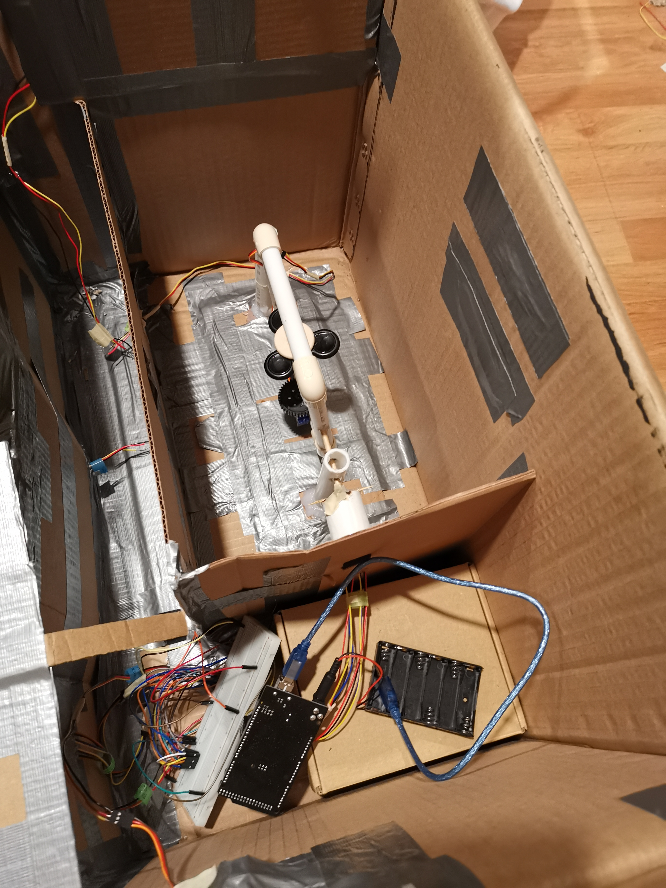
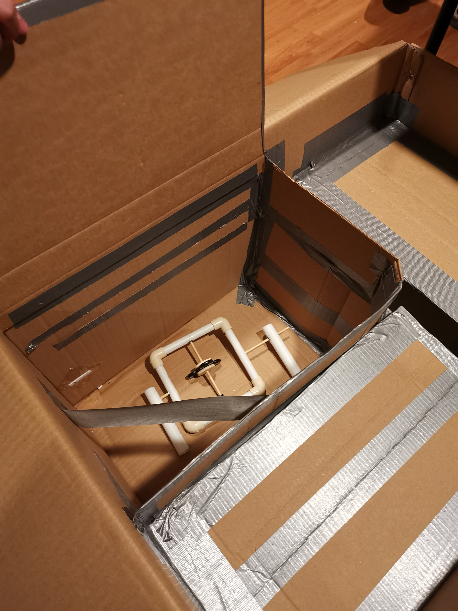

# Nocturne
Rudimentary Spacecraft Guidance System

Nocturne is a Rudimentary Spacecraft Guidance System, made from three gyroscopes that can detect the angle of movement to 5-10 degree accuracy on three axis. Communication between the Arduino and controller (computer) is through Bluetooth (originally over TCP through a Raspberry Pi). Code is written in Java anc C++ (Arduino), with some Python testing processes. Software allows for real-time display of angular movement (numerically and visually), moving averages of the movement, logged data, flight duration, and testing of the fins. 

[Prospectus](https://github.com/jimwu6/Nocturne/blob/master/Prospectus.pdf)

[Documentation](https://github.com/jimwu6/Nocturne/blob/master/Documentation.pdf)

Additional photos/videos, miscellaneous files, and logging data available on [Google Drive](https://drive.google.com/open?id=1PzD2L6kO2qk6P6tKBkJRzBFcbimKceZV).

Below are sample images of the GUI used and the construction of the gyroscopes. 

